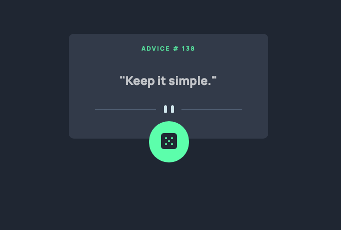

# Frontend Mentor - Advice generator app solution

This is a solution to the [Advice generator app challenge on Frontend Mentor](https://www.frontendmentor.io/challenges/advice-generator-app-QdUG-13db). Frontend Mentor challenges help you improve your coding skills by building realistic projects.

## Overview

### Screenshot

### Links

- Solution URL: https://github.com/maxkaiser100/advice-generator.git
- Live Site URL: https://maxkaiser100.github.io/advice-generator/

## My process

### Built with

- Semantic HTML5 markup
- CSS custom properties
- Flexbox
- Mobile-first workflow
- Sass

## Author

- Frontend Mentor - @maxKaiser

